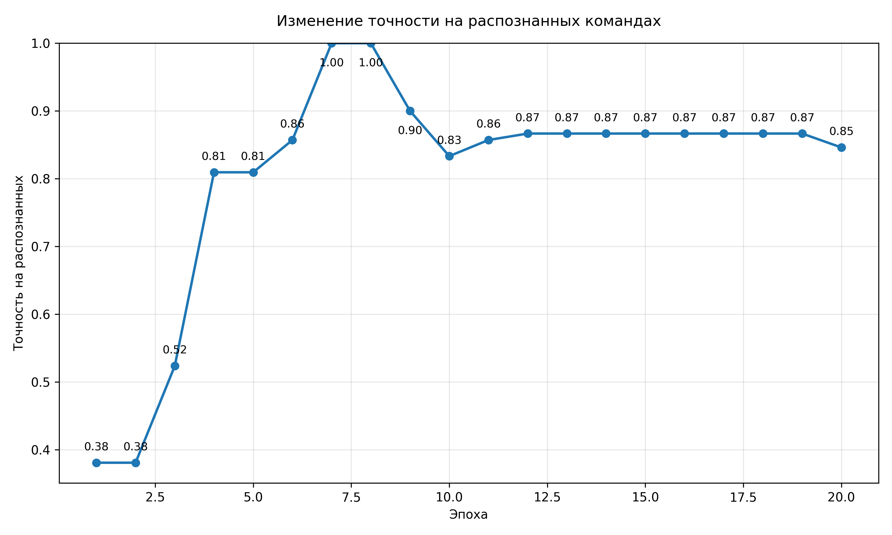
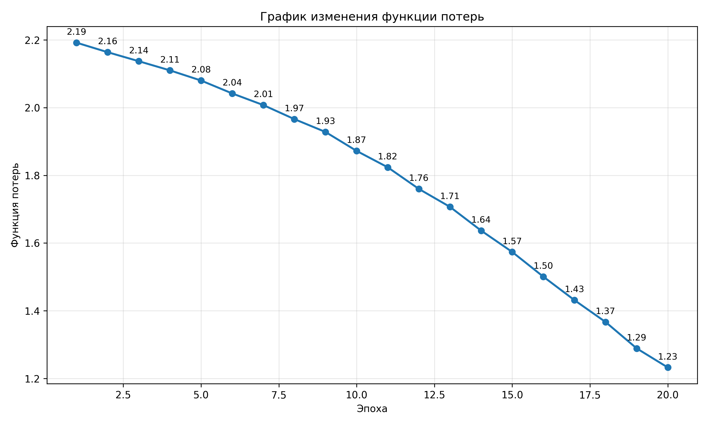
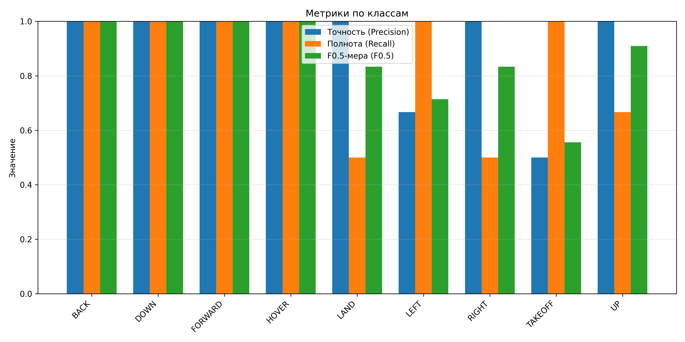
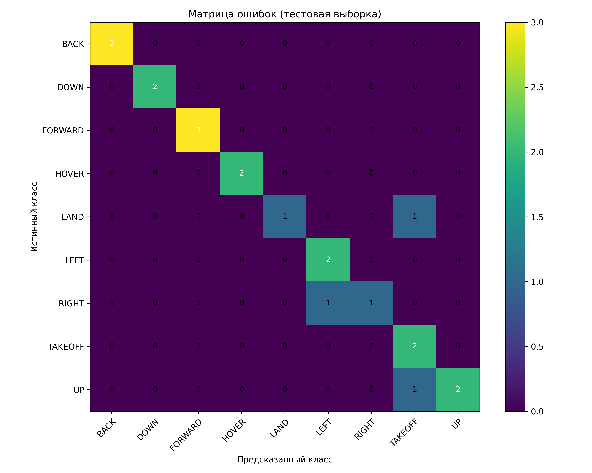

# voice-recognition-airsim

# Система голосового управления БПЛА в AirSim

## Описание проекта

В рамках данного проекта реализована система голосового управления моделью беспилотного летательного аппарата (БПЛА) в симуляционной среде **Microsoft AirSim**.

Основная задача системы заключается в построении полного программного конвейера, включающего:

- распознавание речи пользователя;
- интерпретацию голосовой команды;
- передачу управляющего воздействия модели дрона в симуляторе.

Система реализована на языке **Python** и использует современные методы обработки естественного языка и машинного обучения.

Полный цикл работы системы выглядит следующим образом:

1. Аудиосигнал поступает с микрофона.
2. Речь распознаётся библиотекой **Vosk**.
3. Распознанный текст передаётся в модель классификации команд.
4. Модель определяет соответствующий класс управления.
5. Команда передаётся в симулятор **AirSim** через Python API.
6. Модель БПЛА выполняет соответствующее движение.

---

# Классы голосовых команд

В системе реализовано **9 основных команд управления**:

- TAKEOFF — взлёт
- LAND — посадка
- HOVER — зависание
- FORWARD — движение вперёд
- BACK — движение назад
- LEFT — движение влево
- RIGHT — движение вправо
- UP — движение вверх
- DOWN — движение вниз

---

# Модель классификации команд

Для интерпретации распознанных голосовых команд используется модель **классификации интентов (intent classification)**.

## Датасет

Для обучения модели был подготовлен датасет текстовых команд на русском языке в формате **CSV**, где каждой фразе соответствует метка класса команды.

## Векторное представление текста

Текстовые команды преобразуются в числовые признаки с помощью предобученной модели:

Модель формирует **векторные представления предложений (sentence embeddings)**, которые используются в качестве входных данных для классификатора.

## Архитектура модели

Классификатор представляет собой небольшую нейронную сеть, включающую:

- полносвязные слои 
- функцию активации ReLU
- dropout-регуляризацию

Параметры обучения:

- функция потерь — CrossEntropyLoss
- оптимизатор — AdamW
- разделение данных на обучающую и тестовую выборки

---

# Результаты обучения

В процессе обучения фиксировались значения **точности (accuracy)** и **функции потерь (loss)** на тестовой выборке.

## Изменение точности по эпохам

На графике показано изменение точности классификации на тестовой выборке в процессе обучения.  
В первые эпохи наблюдается быстрый рост точности, после чего значение стабилизируется на уровне около **0.86**, что свидетельствует о сходимости модели.

---

## Изменение функции потерь

График функции потерь демонстрирует **постепенное снижение значения loss** на протяжении обучения, что подтверждает корректное обучение модели и извлечение полезных закономерностей из данных.

---

# Метрики качества

Для оценки качества классификации были рассчитаны основные метрики:

- **Precision (точность)**
- **Recall (полнота)**
- **F1-score**

## Метрики по классам

Диаграмма показывает значения precision, recall и F1-меры для каждого класса команд.  
Для большинства команд наблюдаются высокие значения метрик, что свидетельствует о хорошей способности модели различать различные типы управляющих команд.

---

# Матрица ошибок

Матрица ошибок отображает распределение предсказаний модели относительно истинных классов.

Основная часть значений расположена на главной диагонали матрицы, что указывает на корректную классификацию большинства команд. Небольшое количество ошибок возникает между семантически близкими командами.

---

# Демонстрация работы системы

